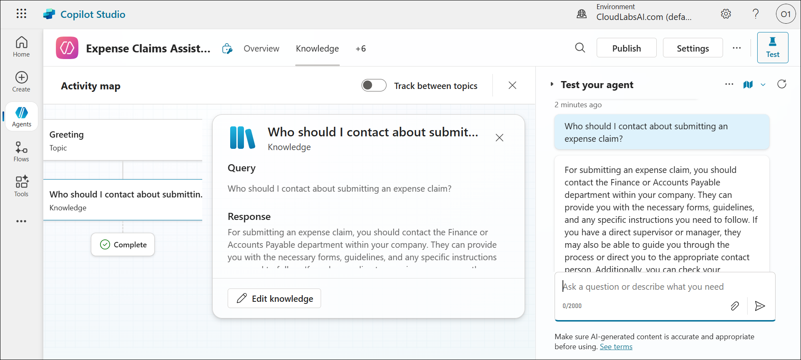
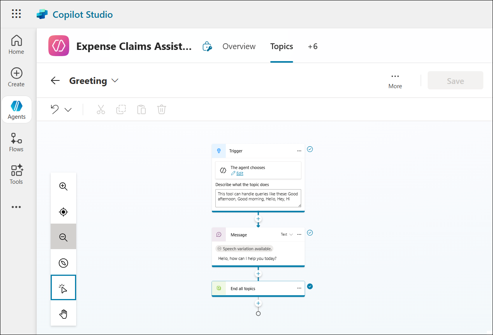

# Lab 01: Create an agent with Copilot Studio

## Estimated Duration: 30 Minutes

## Lab Overview

In this Lab, you’ll use Copilot Studio to create a simple agent that answers employee questions about expense policies in a fictional corporation.

## Lab Objective

In this lab, you will perform the following:

Task 1: Create an agent
Task 2: Manage topics in your agent
Task 3: Add a knowledge source for Generative AI responses
Task 4: Publish your agent

Let’s start by using Copilot Studio to create a new agent. The agent will initially have very limited capabilities, which you’ll extend later in the exercise.

## Task 1: Create an agent

Let’s start by using Copilot Studio to create a new agent. The agent will initially have very limited capabilities, which you’ll extend later in the exercise.

1. Open a new tab in the browser, right-click on the following link [Copilot Studio](https://copilotstudio.microsoft.com/), then Copy link and paste it in a browser tab to log in to Copilot Studio.

    

2. On the **Sign into Microsoft Azure tab**, you will see a login screen. Enter the following email/username, and then click on **Next**.
   
   - **Email/Username:** <inject key="AzureAdUserEmail"></inject>

     

3. Now enter the following password and click on **Sign in**.

   - **Password:** <inject key="AzureAdUserPassword"></inject>

      

4. If you see the pop-up **Stay Signed in?**, click **No**.

   

5. The first time you open Copilot Studio, it may display a chat interface to create your first agent. If this happens, click the **(…)** menu **(1)** at the top right (next to the Create button) and select **Cancel agent creation (2)**.

     

    >**Note:** if prompted **Are you sure you want to leave
    
    

6. The Copilot Studio Home page appears, which should look similar to this:

    

7. On the home page, you can start creating an agent and view agents you have recently worked on. The Power Apps environment in which your agents are defined is shown at the top of the page. You can also navigate to the Create page for more agent creation options and the Agents page to view all of your existing agents.

8. On the **Create** page, click **Create (1)** from the left navigation menu, then click **New agent (2)** to start creating a new agent.

    

9. Copilot Studio responds by providing a chat interface in which you can describe the functionality of the agent you want to build.

    

10. On the **Agent** page, type the below agent request in the message box **(1)**, then click the **Send** icon **(2)** to proceed.

    ```prompt
    Create an agent to help employees with expense claims.
    ```
    

11. Review the response from Copilot Studio. The chat pane should look similar to the following:

    

12. Continue the conversation with Copilot to define your agent by providing the following details:  
    - Assign an appropriate name.
    - Use a friendly and professional tone.  
    - Do not use any publicly accessible websites as a source of information (a knowledge source will be added later).  
    - Avoid offering any tax-related advice.

13. Once completed, a preview of the chat interface for your agent will appear alongside the conversation used to create it and select **Create** at the top right to create your agent.

      

14. After the agent is created, the agent details page is displayed with its configuration and the **Test your agent** panel.

     

15. In the **Test your agent** pane, enter the following prompt **(1)** and click the **Send** icon **(2)** to test the agent’s response:  

    ```prompt
    Hello
    ```
    

16. Review the response to ensure it provides an appropriate and relevant message.

      

17. Now, in the **Test your agent** pane, enter the following prompt and press **Enter** to check if the agent provides the correct guidance:  

    ```prompt
    Who should I contact about submitting an expense claim?
    ```
    
18. This time, the response may be appropriate but is likely to be generic. In a real organization, the agent should provide specific contact details, such as an email address or phone number, for the user to reach out to.

    

19. Let's try another prompt in the **Test your agent** pane to check its response:  

    ```prompt
    What's the expense limit for a hotel stay?
    ```

20. Again, the response may be appropriate but generic. In a real organization, the agent should provide a more specific answer based on the company’s expense policies.

    

## Task 2: Manage topics in your agent

You can use topics to provide explicit responses to triggers, such as common questions or requests that you expect your users to enter.

1. On the page for your agent, click the **+6** menu **(1)** at the top, then select **Topics (2)** to view the list of topics associated with your agent.

    

2. The agent includes several **Custom** topics triggered by user input, as well as **System** topics triggered by specific events such as errors or unexpected input. You can filter the topics by category, or select the **All** filter to view all topics.

     

3. On the **Topics** page, select **Custom** **(1)**, then click the **Greeting** topic **(2)** to open it in the authoring canvas, which is the visual designer for creating and editing topics.

     

4. The **Greeting** topic is triggered when the user input contains one of the following phrases:

    - *Good afternoon*
    - *Good morning*
    - *Hello*
    - *Hey*
    - *Hi*

    The configured response for this trigger is: *Hello. How can I help you today?* This topic explains the greeting response you observed earlier during testing.

    

5. On the **Topics** page, select **System** **(1)** to view the system topics for your agent. These topics handle common events in a conversation and cannot be deleted.  
    - **Conversational boosting (2)**: Triggered when the agent cannot identify the user’s intent. It attempts to respond using generative AI.  
    - **Fallback (3)**: Acts as a fail-safe when both intent recognition and conversational AI fail. It allows the user to try again up to three times before gracefully ending the conversation, often by escalating to a human operator.

    

6. Return to the **Topics** page, click **+ Add a topic** **(1)**, and from the drop-down menu select **Add from description with Copilot** **(2)**.

    

7. In the **Add from description with Copilot** dialog box, enter **Ask about expenses contact** in the **Name your topic** field **(1)**. In the **Create a topic to...** field **(2)**, type:  

    ```prompt
    When the user asks who to contact about expense claims, tell them to send an email to finance@contoso.com
    ```

8. Click **Create** **(3)** to generate the new topic.

    

    > **Note:** Copilot results may vary, so you may need to play around with this prompt for your expected results.
    
    > **Note:** If prompted, select Allow for see text and images copied to the clipboard

9. After a short wait, the new topic named **Ask about expenses contact** is created and opens in the authoring canvas, displaying its trigger phrases and response flow and click the **Save** button (at the top right) to save the new topic in your agent.
 
    

    > **Note:**  If the nodes in the topic are different from the above image, delete the topic, and create the topic again.

10. Open the **Test** pane, enter the following prompt **(1)**, and click the **Send** icon **(2)** to test the new topic:  

    ```prompt
    Who should I contact about submitting an expense claim?
    ```
    

11. View the response in the **Test your agent** pane. It should be based on the topic you just added, even though the text you entered does not exactly match any of the trigger phrases — the semantic similarity is sufficient to trigger the topic.

     

## Task 3: Add a knowledge source for Generative AI responses

You can add topics for all of the inputs that you expect a user to enter; but you can’t realistically expect to anticipate every question that will be asked. Currently, your agent uses a Conversation boosting topic to generate AI responses from a language model, but this results in generic answers. You need to provide a source of knowledge in which the generative AI responses can be grounded to provide more relevant information.

1. Open a new browser tab and download the [expenses policy document](https://raw.githubusercontent.com/MicrosoftLearning/mslearn-copilotstudio/main/expenses/Expenses_Policy.docx) file from `https://github.com/MicrosoftLearning/mslearn-copilotstudio/raw/main/expenses/Expenses_Policy.docx`, saving it locally. This document contains details of the expenses policy for the fictional Contoso corporation.

2. Return to the Copilot Studio browser tab, close the **Test your agent** pane **(1)** to view the page more clearly, then select the **Knowledge** tab **(2)** to see the knowledge sources defined for your agent. At this stage, there should be no knowledge sources listed.

   

   

3. Click **+ Add knowledge** to view the available types of knowledge sources you can add to your agent.

    

4. In the **Upload file** section, click **select to browse**. In the file browser window, navigate to the **Downloads** folder, select the **Expenses_Policy** file **(1)**, and click **Open (2)** to upload it as a knowledge source for your agent.

    

   

5. On the **Upload files** page, verify that **Expenses_Policy.docx** is listed, then click **Add to agent** to include it as a knowledge source for your agent.

    

    > **Note:** After uploading the file, the system will index its contents before it can be used by your agent. This process may take up to 10 minutes or longer.

6. Once the file status shows as **Ready**, click the **+6** menu **(1)** at the top and select **Topics (2)**.  

   

   

8. On the **Topics** page, select **System** to filter and display all system topics.  

9. From the list of system topics, click **Conversational boosting** to open it. This topic is triggered when the agent encounters an unknown intent and then attempts to generate a response using available knowledge sources, such as the file you uploaded.

   

    

   > **Note:** If no relevant answer is found in the custom knowledge sources you have added, the topic may use the knowledge inherent in the language model to provide a more generic answer. You can configure the topic to restrict its search to specific knowledge stores if you want greater control over the generative AI responses it returns.

11. Expand the **Test** pane and restart the conversation. In the message box **(1)**, enter the following prompt, then click the **Send** icon **(2)**:  

    ```prompt
    What's the expense limit for a hotel stay?
    ```

    

12. Verify that the response is generated using the information from the uploaded knowledge source and that it includes a citation reference to the document.

    

13. On the **Test your agent** pane, try asking follow-up questions to verify the uploaded knowledge is working correctly.

     ```prompt
    What about flights?
    ```

    

15. Type **What guidelines are there for entertainment expenses?** and verify the response lists the correct guidelines for claiming entertainment expenses.  
Ensure the responses match the uploaded knowledge content and reference any supporting documents as expected.

    


## Task 4: Publish your agent

Now that you have a working agent, you can publish it for people to use. The available channels through which you can deliver your agent depend on the type of authentication you want to use to restrict access to it. In this case, you’ll enable access for anyone and then publish the agent for use in a demo web page.

1. At the top of the page, click **+6 (1)** and select **Channels (2)** from the drop-down list to open the available deployment channels for your agent. Review the channels you can deploy your agent to. The available channels will depend on your agent’s authentication settings.

  

2. At the top of the page, click **Settings** to open the configuration options for your agent.

     

3. In the **Settings** pane, select **Security (1)** from the left menu, then select **Authentication (2)** under the *Security* section.  

   

4. In the **Authentication** settings, select **No authentication (1)** to make the agent publicly available without sign-in. Click **Save (2)** to apply the change.  

   

5. In the **Save this configuration?** confirmation dialog, review the details and click **Save** again to confirm enabling access to the agent for everyone.  

   

6. At the top of the **Channels** page, click **Publish**.  

   

7. On the **Publish this agent** page, review the settings and click **Publish**.  

   

8. Once publishing is complete, verify the status under **Published agent status** and select **Demo website** to test the agent.  

    

9. In the **Demo website** pane, enter the following settings:
    - **Welcome message**: `Ask me about Expense claims` **(1)**
    - **Conversation starters**: **(2)**

        ```prompt
        "Hello"
        "Who should I contact with expense enquiries?"
        "What are the expense limits for flights?"`
        ```

10. Select **Save (3)** to save the settings. Then Copy the link to your agent demo website to the clipboard.

     

     

11. In a new browser tab, navigate to the URL you copied to open the demo website. The page should look similar to the following:

     

13. In the demo website, enter the message `What are the expense limits for meals?` **(1)** in the chat box and click the **Send** button **(2)** to submit your question.  
   
     

14. View the agent’s response, which should display the meal expense policy including limits, restrictions, and allowed scenarios. Try a few more questions related to expense claims and observe the responses. The agent will have limited functionality but should return relevant answers.

    

